# Live-play tools (Fruit games)

These are the tools used to actually play and calculate against the Fruit UCI
engine, developed and hardened over sixteen games (see `FINDINGS.md`'s dated
entries for the specific incidents behind each one). Moved here from a
session-tied scratchpad on 2026-09-02 so they survive a session restart, not
just a context compaction — nothing in these scripts is one-off scratch work.

All of them assume `chessdb` (this crate's plugin, `nu_plugin_chessdb`) is
already registered in the active nu shell (`plugin add` / `plugin use`). None
of them print or rely on `final_score`/any aggregate numeric score, and
(2026-09-02, extending that same discipline) none of them print `see_cp`/
`consequence` either — those per-fact SEE valuations looked more trustworthy
than the aggregate because each is tied to one concrete exchange, but
`find_forks` is still backed by the known-buggy `see_chain`, and a real game
(Game 12) shows relying on the direct-subtraction-priced ones can still lead
to a move Fruit's own search rated below its actual best. What these scripts
return instead: raw counts (`attacker_count`/`defender_count`), piece identity
and standard value (a fixed constant, not a search result), and fork/skewer
*target lists* — the structural facts, never the valuation. When one of
these flags fires, that's the cue to actually calculate the exchange
yourself (`calc_line.nu`, `attackers_map.nu`/`square_swap_list.nu`), not to
read a verdict off this output. See `.claude/skills/position-eval/SKILL.md`
for the full reasoning behind both. **A defender-count majority is not
itself safety** — check every attacker's real value against the defended
piece's, not just the count (`chessdb_defender_count_vs_attacker_value`,
game 16, 2026-09-03): a cheap piece capturing an expensive one already wins
material on the very first exchange, regardless of how many pieces queue up
to recapture afterward.

## Everything here speaks nuon, both directions (2026-09-03)

Every script below takes a nuon list literal of uci moves in (parsed with
`from nuon`, never a hand-joined space string and never a hand-typed FEN —
an OS shell can only ever hand a script a string argv, so that string must
be real nuon text, not an invented format) and returns exactly one nuon
record out (`| to nuon --indent 2`, no `print`, no ascii art). This replaced
an earlier convention (`board_overlay.nu`'s bracket-legend ascii grid) that
solved the same "never hand-parse a FEN" problem visually instead of
structurally — the visual form is gone, the underlying goal (exact,
machine-checkable board facts, never eyeballed) is unchanged. Usage:

```
nu check_move.nu '[e2e4 e7e5 g1f3]' 'f8c5'
nu material.nu '[e2e4 e7e5]'                    # move list defaults to [] (start position)
```

`board_overlay.nu` is the shared module every script below `use`s — not run
directly. It exports two things: `fen-to-board` (a FEN's occupied squares
as `square -> {color, role}`, real board color, never mover-relative — see
`chessdb_mover_not_color`) and `history-to-fen` (the shared move-replay
loop every script used to duplicate). Scripts whose whole job is a single
piece or square (`control_map.nu`, `attackers_map.nu`, `control_overlap.nu`)
deliberately do NOT dump the full board — the targeted answer already
covers the question, a 32-piece record every call would be noise, not
signal. Scripts whose job is "show me the resulting position"
(`check_move.nu`, `calc_line.nu`, `forcing_moves.nu`) do include a `board`
field, since verifying the resulting position is the actual point.

## The shakmaty-1:1 architecture (2026-09-03, later the same day)

A second, deeper shift the same day: `chessdb` itself no longer composes
geometric answers in Rust. The plugin now exposes shakmaty's own functions
close to 1:1 — `chessdb geom-attacks`/`geom-ray`/`geom-between`/
`geom-aligned` (the `shakmaty::attacks::` module, pure geometry, `occupied`
always an explicit input, never implicitly "the real board's current
occupancy"), `chessdb board-pieces`/`board-piece-at` (`Board`'s own
piece-placement bitboards), `chessdb square-is-light` (`Square::is_light`,
no board needed at all). Composition — "what attacks this square," "what
does this square control," the swap-list's recursive x-ray removal, the
whole-board probe — moved to nushell, in `shakmaty_compose.nu`
(`attacks-to`, `attacks-from`, `swap-list`, `board-probe`), not rust. That
module is what `control_map.nu`, `attackers_map.nu`, `square_swap_list.nu`,
and `board_probe.nu` are actually built on now.

**Why:** explicit user direction — "instead of a skill asking the plugin
for the right questions, a tree of reports [is] compiled ... in nushell,"
and specifically: "keep the bitboard at all levels and let the client
translate into FEN, PGN, ascii-board, etc." Since `occupied` is always a
plain `list<string>` at the leaf level (exactly what a shakmaty `Bitboard`
serializes to), removing a square from it for the swap-list's x-ray
recursion is just an ordinary nu `where` filter — no rust-side loop is
needed once the leaves are this atomic. The four commands this replaced
(`square-control`, `square-attackers`, `square-swap-list`, `board-probe` —
all built earlier the same session) were **removed**, not deprecated
alongside the new architecture, after each nu-composed replacement was
verified byte-identical against the rust one it replaced on real positions
(the same A/B-diff discipline this crate's own `detect_skewers` migration
used) — see `FINDINGS.md` for the verification record.

Every shakmaty function this crate uses, and how they compile up from leaf
commands through nu composition into the actual tools (same content also
kept as a standalone mind map, `../shakmaty_architecture.mm`, for
FreeMind/FreePlane):

```mermaid
flowchart BT
    subgraph L1["Layer 1 — chessdb leaf commands (rust, ~1:1 shakmaty)"]
        geom_attacks["geom-attacks
        shakmaty::attacks::attacks(sq, piece, occupied)"]
        geom_ray["geom-ray
        shakmaty::attacks::ray(a, b)"]
        geom_between["geom-between
        shakmaty::attacks::between(a, b)"]
        geom_aligned["geom-aligned
        shakmaty::attacks::aligned(a, b, c)"]
        board_pieces["board-pieces
        Board::occupied / by_color / by_role / by_piece"]
        board_piece_at["board-piece-at
        Board::piece_at(sq)"]
        square_is_light["square-is-light
        Square::is_light()"]
        legal_moves["legal-moves
        Position::legal_moves(), SanPlus::from_move()"]
        checker_summary["checker-summary
        Position::checkers/is_check/is_checkmate"]
        fen_info["fen-info
        Position::halfmoves/fullmoves/ep_square/castles"]
        apply_uci["apply-uci
        Position::play()"]
        hugm_eval["hugm-eval
        tactical/positional detectors (sensor_report) -- unrelated
        pipeline, not shakmaty-leaf, feeds full-report directly"]
    end

    subgraph L2["Layer 2 — nu composition (shakmaty_compose.nu)"]
        attacks_to["attacks-to"]
        attacks_from["attacks-from"]
        swap_list["swap-list
        (recursive x-ray removal)"]
        board_probe["board-probe
        (O(pieces) round trips, inverted in nu)"]
        full_report["full-report
        (+ strip-scores filter)"]
    end

    subgraph L3["Layer 3 — scripts/play/*.nu (the tools)"]
        control_map["control_map.nu"]
        attackers_map["attackers_map.nu"]
        square_swap_list_nu["square_swap_list.nu"]
        board_probe_nu["board_probe.nu"]
        full_report_nu["full_report.nu"]
        check_move["check_move.nu / check_move_2ply.nu / calc_line.nu"]
        forcing_moves["forcing_moves.nu"]
    end

    geom_attacks --> attacks_to
    board_pieces --> attacks_to
    board_piece_at --> attacks_to

    geom_attacks --> attacks_from
    board_piece_at --> attacks_from

    attacks_to --> swap_list
    board_pieces --> swap_list

    geom_attacks --> board_probe
    board_pieces --> board_probe
    board_piece_at --> board_probe
    square_is_light --> board_probe
    fen_info --> board_probe
    checker_summary --> board_probe
    legal_moves --> board_probe

    board_probe --> full_report
    hugm_eval --> full_report

    attacks_from --> control_map
    attacks_to --> attackers_map
    swap_list --> square_swap_list_nu
    board_probe --> board_probe_nu
    full_report --> full_report_nu
    legal_moves --> forcing_moves

    apply_uci --> check_move
    hugm_eval --> check_move
```



- **`full_report.nu <history>`** — the single comprehensive position
  report: `board_probe.nu`'s shakmaty-derived geometric/structural facts
  merged with the tactical/positional detector layer
  (hanging/forks/pins/skewers/discovered/outnumbered/mover_favored/
  overloaded/false_defense/false_safety, outposts/open_files/passed_pawns/
  doubled_pawns/isolated_pawns/pawn_islands/pawn_breaks/pawn_majority/
  rook_on_seventh/king_exposure) plus a `detectors` field (see below),
  every computed-valuation field stripped (`shakmaty_compose.nu`'s
  `strip-scores` — no `final_score`, no `aggregated.*_cp`, no
  `engine_score`, no per-fact `consequence`/`see_cp`/`centipawns`, by a
  generic name-pattern filter, not a hand-audited allowlist). This is what
  `.claude/skills/position-eval/SKILL.md` reads from now — one call, then
  read the report in priority order (tactics/safety first, down to piece
  activity last), rather than deciding which of several narrow tools
  answers which question.

  **`detectors`** (2026-09-03) — a gap audit against
  [dev-arcturus/positional_chess](https://github.com/dev-arcturus/positional_chess),
  a comparable browser/wasm chess-analysis tool with the same
  raw-engine-plus-structured-fact-layer shape, whose README lists ~70
  named motifs. Deliberately excludes anything requiring a judgment call
  (their `sacrifice`, `tempo`, `prophylaxis`, `bad_bishop`, move-quality
  classification via a win-rate sigmoid, ...) — those are computed
  valuations by another name, the exact thing `strip-scores` exists to
  keep out. What's in `detectors`, all pure structural facts composed
  entirely from the leaf commands: `battery` (2+ same-color sliding
  pieces aligned on one ray with nothing between — subsumes the classic
  "connected rooks" as one instance, not a separate detector),
  `knights_on_rim` (file a/h specifically, not rank 1/8 — a real bug
  caught by testing against the start position, where every knight starts
  on rank 1/8 and isn't rim), `fianchettoed_bishops`,
  `long_diagonal_pieces`, `semi_open_files` (distinct from
  `positional.open_files` — one side absent, not both), `supported_pawns`
  (defended by another own pawn specifically), `backward_pawns` (distinct
  from `isolated_pawns` — can have adjacent-file pawns, just none still
  behind or level to defend it). Two more live as standalone,
  square-scoped functions rather than whole-board sweeps (not part of the
  bundled `detectors` field): `piece-mobility-safety [fen, square]` — the
  raw fact behind game 15's Qxa7 queen trap, every legal destination for
  one piece with its real attacker list, formalized instead of a one-off
  manual check — and `king-mobility [fen]` (side to move's king only,
  legal move generation isn't defined for the non-moving side).

- **`board_probe.nu <history>`** — every geometric/positional fact shakmaty
  can answer about one position, compiled into one comprehensive record:
  all 64 squares' occupant/is_light/controls/attacked_by_white/
  attacked_by_black, plus side to move, castling, en passant, check/mate/
  stalemate, checkers, legal moves (san+uci), and raw material counts.
  Composed in nu (`shakmaty_compose.nu`'s `board-probe`) from the leaf
  commands, O(pieces) plugin round trips rather than O(64 x pieces) —
  computes what each piece attacks once, then inverts that into "who
  attacks this square" per square in nu. Deliberately no highlighting, no
  ascii, no filtering: this is the full, honest source of truth; a
  separate downstream client applies whatever filter it needs on top of
  this record. Excludes swap-list x-ray plies — that stays
  `square_swap_list.nu`'s job, since it's the expensive recursive one and
  most squares aren't contested.

- **`check_move.nu <history> <candidate>`** — screens one candidate move:
  applies it, returns `my_pieces_at_risk` (hanging/outnumbered/mover-favored
  on your own side) as its own top-level field, read first on purpose, plus
  the resulting `board`, fork target lists, and discovered attacks. The
  fast, mechanical, always-run-first filter. No server-generated prose
  (`.explanations`) — that text embeds `see_cp`/`consequence`/tropism/
  initiative scores by construction; the structured record covers the same
  ground without a number attached. Also returns
  `destination_square_swap_list` — `swap-list` on the destination square,
  computed on the position *before* the candidate is applied — for free on
  every call, so a piece backed up behind whatever's being traded with
  (invisible to `my_pieces_at_risk`, which only checks the move's own
  immediate safety) is never missed for lack of a second command (Game 18,
  `FINDINGS.md`, 2026-09-03: a queen lined up behind a rook on an open file
  cost a queen this exact way before this field existed).

- **`material.nu <history>`** — raw material by piece count for both sides,
  nothing else. Deliberately never touches `material.balance.centipawns` —
  even a simple, untuned sum-of-standard-values is still a number inviting
  "just check if it's decisive" instead of actually judging compensation and
  activity. Count the imbalance yourself from the returned piece counts
  using standard values (pawn=1, knight/bishop=3, rook=5, queen=9), per the
  position-eval skill.

- **`check_move_2ply.nu <history> <candidate>`** — after playing the
  candidate, enumerates *every* legal opponent reply (no ranking, no "best
  reply" picked) and reruns the same own-pieces-at-risk check on each,
  returning only the replies that create a new threat. Breadth-first
  enumeration, not a search.

- **`forcing_moves.nu <history>`** — the starting `board`, then every legal
  check and capture for the side to move (from `mobility_san`'s own
  notation — real `+`/`#` suffixes since 2026-09-03, see below), unranked.
  The branch list a real calculation starts from.

- **`calc_line.nu <history> <candidate-line>`** — walks a full calculated
  variation move by move, returning one record per ply (`board`, hanging
  pieces, fork target lists, king exposure, raw material), not just the
  last one. Stops cleanly on an illegal move (`stopped_illegal_at`). Use
  with `forcing_moves.nu`: enumerate the forcing branches, then walk the
  testing ones here to a quiet position before judging it. This is *the*
  way to answer "is this exchange actually good" — by watching the raw
  piece list change ply by ply, not by reading a precomputed valuation.

- **`square_swap_list.nu <history> <square>`** — the full occupancy-aware
  exchange picture for one square: every piece (either side) that attacks
  it right now, plus every piece only revealed once a nearer piece is
  removed (an x-ray), recursively, ply by ply, real piece identities and
  standard values. Notation like `0ply q 1ply NbPQ 2ply B`: uppercase =
  the mover's own pieces, lowercase = the opponent's, sorted ascending by
  value within each ply. Composed in nu (`shakmaty_compose.nu`'s
  `swap-list`): recursively removes each ply's attacker squares from the
  occupancy list and re-queries `attacks-to` until no new attacker appears
  — the recursion that used to be a rust loop is now just a nu `where`
  filter over a plain square list. This is the tool game 16's decisive
  mistake needed and didn't have: a defender-count majority (`1v3`, `1v2`)
  is not safety if the single attacker is cheaper than the defended piece
  — this command puts every attacker's real value directly in the ply list
  instead of a bare count, so that check no longer has to be done from
  memory. Never computes a "hanging" verdict itself, same discipline as
  everything else here.

- **`fruit_move.sh "<uci history>" [movetime_ms]`** — asks the real Fruit
  UCI engine for its actual move from a position (default 1000ms). Bash,
  not nu — plain text in/out, since it talks to Fruit's own UCI protocol,
  not chessdb. This is Fruit's real search — use it to get the opponent's
  actual reply, never as a stand-in for your own calculation.

- **`fruit_analyze.sh "<uci history>" [movetime_ms]`** — for each prefix of
  a finished game's move list, asks Fruit to search that position and
  prints its own score (from whoever's turn it is at that ply — the score's
  perspective flips every ply, normalize by hand before comparing across
  plies). Used for postmortems, not live play.

- **`control_map.nu <history> <square>`** — every square the piece on
  `<square>` controls, split into `own_piece_defended` /
  `enemy_piece_attacked` / `empty_square_controlled`. Composed in nu
  (`shakmaty_compose.nu`'s `attacks-from`), directly in response to the
  `Bd3` blunder (`FINDINGS.md`, 2026-09-02): a structured spatial view
  instead of mentally computing "does this diagonal/file/knight-jump reach
  that square," which is exactly the arithmetic that went wrong live.
  Reach for this before any move that places a piece on a square you
  haven't independently confirmed is safe.

- **`attackers_map.nu <history> <square>`** — the reverse question: every
  piece that attacks `<square>`, each with its own color+role attached,
  split into `attacked_by_white`/`attacked_by_black`. Composed in nu
  (`shakmaty_compose.nu`'s `attacks-to`). More directly useful than
  `control_map.nu` for "is this square safe to move to" — it doesn't
  require first guessing which enemy piece to check, and works on an empty
  target square. For the fuller picture including x-ray reveals, use
  `square_swap_list.nu` instead.

- **`control_overlap.nu <history>`** — whole-board version: every square
  White controls, Black controls, or both (`contested`), no single square
  of interest. Built on `chessdb attack-summary` (unchanged — a whole-board
  primitive, not a per-square composition, so it wasn't part of the
  shakmaty-1:1 migration). Reach for this for whole-position questions
  ("who controls the center," "is this outpost square actually safe
  long-term") that the other two, both scoped to one piece or one square,
  can't answer.

- **`shakmaty_compose.nu`** — not run directly; the shared nu-composition
  module `control_map.nu`/`attackers_map.nu`/`square_swap_list.nu`/
  `board_probe.nu`/`full_report.nu` all `use`. Exports `attacks-to`,
  `attacks-from`, `swap-list`, `board-probe`, `full-report`, `strip-scores`
  — plus the detector batch (`battery`, `piece-mobility-safety`,
  `king-mobility`, `knights-on-rim`, `fianchettoed-bishops`,
  `long-diagonal-pieces`, `semi-open-files`, `supported-pawns`,
  `backward-pawns`) — each built from the `geom-attacks`/`board-pieces`/
  `board-piece-at`/`square-is-light` leaf commands, each A/B-verified
  byte-identical against the rust-composed command it replaced before
  that command was removed (`attacks-to`/`attacks-from`/`swap-list`/
  `board-probe`), or checked against a real/known position before being
  trusted (the detector batch).

- **`blunder_corpus.nuon`** — a reusable regression corpus of real
  historical blunders mined from `FINDINGS.md` (2026-09-03), each with the
  exact position (reconstructed via `chessdb pgn-to-fens`/`history-to-fen`,
  never hand-typed), what actually went wrong, and which report field
  should show it. Not a script — `open blunder_corpus.nuon` for the raw
  data. Building it caught two real transcription errors in `FINDINGS.md`'s
  own archive (games 13 and 14's written move lists each had an
  inconsistency nobody had mechanically replayed until now) — see the
  entry's own `note` fields and the 2026-09-03 `FINDINGS.md` entries.

- **`test_blunder_corpus.nu`** — re-runs `full_report.nu`/
  `shakmaty_compose.nu` against every position in `blunder_corpus.nuon`
  and prints the current raw fact next to what was recorded when the
  corpus was built, for direct comparison — deliberately no computed
  pass/fail verdict, matching this whole project's standing discipline.
  Re-run after any change that could plausibly touch tactical detection,
  x-ray/swap-list logic, or the leaf commands: these are real historical
  positions that caused real losses, so a regression here is a real
  regression.

## A real bug found while migrating (2026-09-03)

`chessdb legal-moves`'s `mobility_san` never carried the `+`/`#` check/mate
suffix — `San::from_move` (the shakmaty call it used) deliberately omits
that annotation; `SanPlus::from_move` computes it by actually playing the
move and checking the result, and was the call needed instead. This meant
`forcing_moves.nu`'s CHECKS list and CHECKMATE-AVAILABLE detection had
silently returned empty for the tool's entire history — found by
cross-verifying `forcing_moves.nu`'s nuon output against a known Fool's
Mate position (`1.f4 e5 2.g4 Qh4#`) during this migration, not something
anyone had noticed live. Fixed at the source (`core.rs::mobility_summary`);
regression-tested against both a mating and a non-mating check. Capture
(`x`) annotation was never affected — only the check/mate suffix was
missing.

## Method (see `.claude/skills/position-eval/SKILL.md` for the full version)

1. `check_move.nu` any candidate before playing it — cheap, catches the
   single most urgent question.
2. For a sharp or unclear position, don't stop at "nothing hangs": use
   `forcing_moves.nu` + `calc_line.nu` to actually calculate forcing lines
   to a quiet position before judging it.
3. Judge the resulting quiet position on structural merit (material, king
   safety, structure, activity) — never on a score. Compare 2+ safe
   candidates against each other with a real plan, not just against "is
   this safe."
